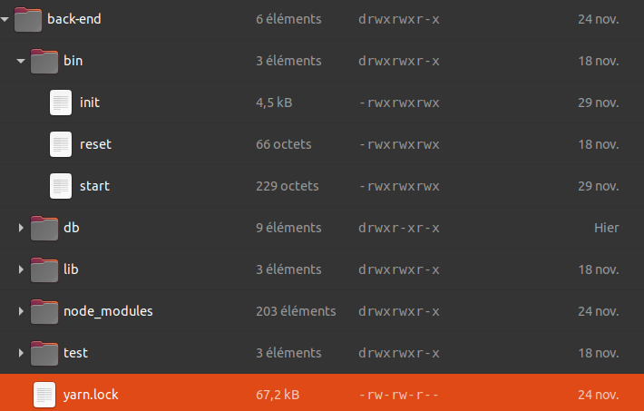
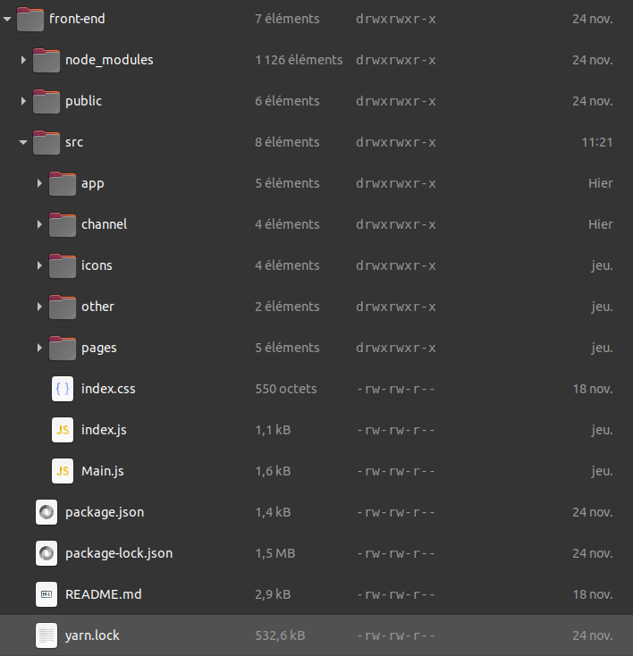
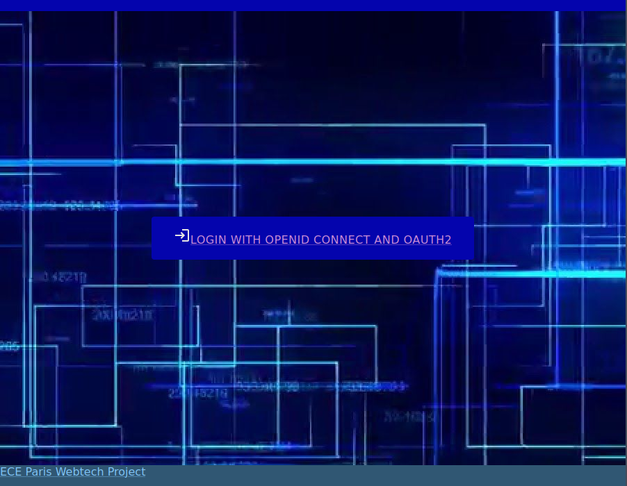
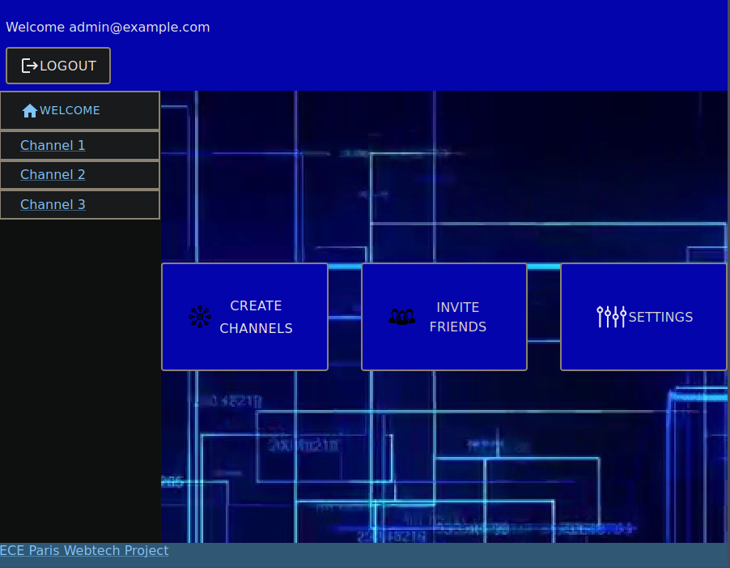
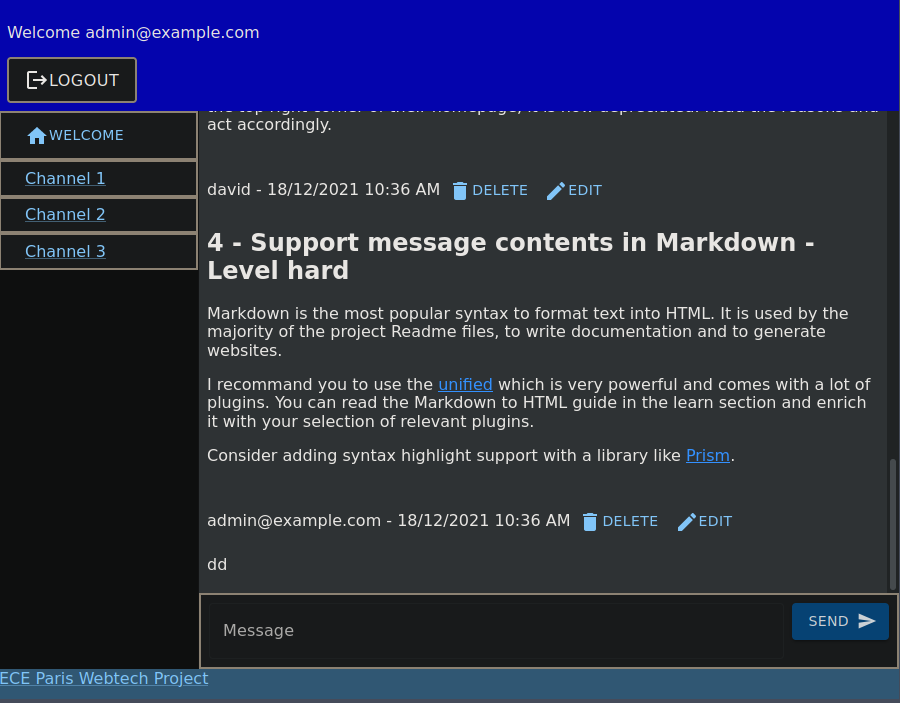
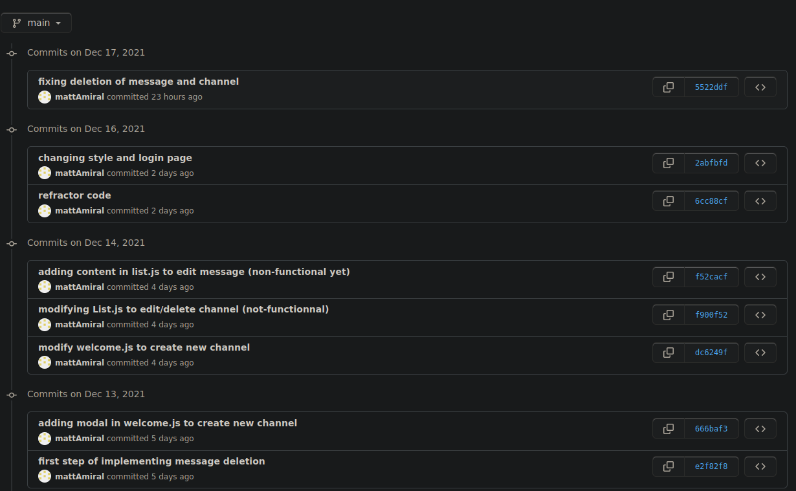
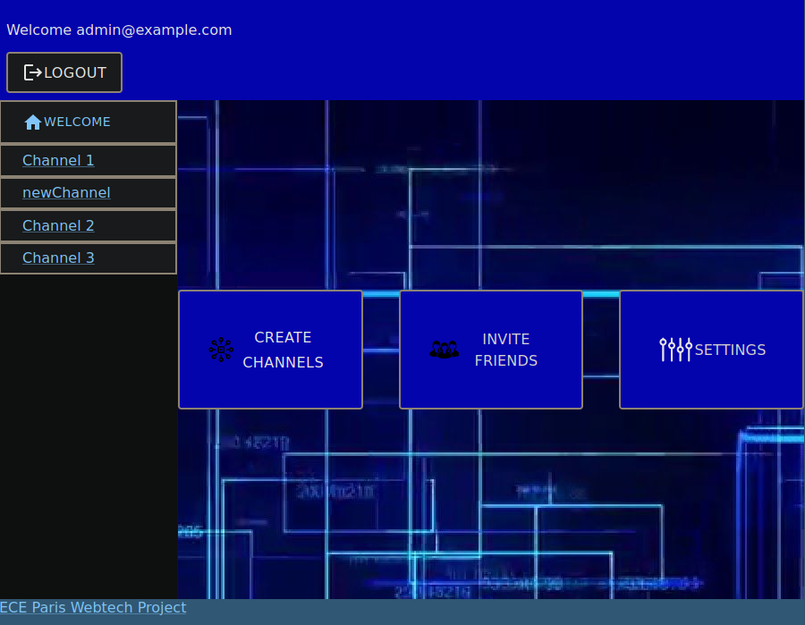

# Chat application - final project


This project combines all the work we have done in all the webtech courses.

This is a simple web application that allows users to chat through different channels, create/delete channels and create/delete messages.


The main points of this chat application are the use of :

- reactJS, a library that allows an easier implementation of html

- Material UI, a library that enables the usage of many icons/buttons/graphical components

- oauth and OpenID via Dex, to enable a secure and unique authentication


## Usage

Before going further make sure you have your ports 3000, 3001 and 5556 open and free. Because these are the local ports we will be using for our application.

To setup this application, these are the following steps to follow to have the application up and running :

* Clone this repository, from your local machine:

  ```
  git clone https://github.com/mattAmiral/webtechProject.git webtech
  ```

* Install [Go](https://golang.org/) and [Dex](https://dexidp.io/docs/getting-started/). For example, on Ubuntu, from your project root directory:   

  ```
  # Install Go
  apt install golang-go
  # Download Dex
  git clone https://github.com/dexidp/dex.git
  # Build Dex
  cd dex
  make
  make examples
  ```

  Note, the provided `.gitignore` file ignores the `dex` folder.

* Register your GitHub application, get the `clientID` and `clientSecret` from GitHub and report them to your Dex configuration. Modify the provided `./dex-config/config.yml` configuration to look like:

  ```yaml
  - type: github
    id: github
    name: GitHub
    config:
      clientID: xxxx98f1c26493dbxxxx
      clientSecret: xxxxxxxxx80e139441b637796b128d8xxxxxxxxx
      redirectURI: http://127.0.0.1:5556/dex/callback
  ```

* Inside `./dex-config/config.yml`, the front-end application is already registered and CORS is activated. Now that Dex is built and configured, you can start the Dex server:

  ```yaml
  cd dex
  bin/dex serve dex-config/config.yaml
  ```

* Start the back-end with another terminal session

  ```bash
  cd back-end
  # Install dependencies (use yarn or npm)
  yarn install
  # Optional, fill the database with initial data
  bin/init
  # Start the back-end
  bin/start
  ```

* Start the front-end with another terminal session

  ```bash
  cd front-end
  # Install dependencies (use yarn or npm)
  yarn install
  # Start the front-end
  yarn start
  ```


## Author


*Matthieu Mouyart, Dona Wendeou*


## Tasks


Project management

* Naming convention   

  *We tried to follow the react and javascript conventions*

  - PascalCase for react components

  - camelCase for non-react components

  - folder names in camelCase

    *The examples provided above are a glimpse of all the naming conventions*

* Project structure   
  *The project is divided in  main folders :*

  - front-end
  - back-end
  - dex
  - images

  Inside the back-end the following image shows the file structure :

​		

​		

Inside the front-end the following image shows the file structure :




* Code quality   
  *We tried to respect a good code quality (i.e. a good indentation to have a nice looking code, logical variable names...)*

* Design, UX   
  *We tried to have an application that incorporates a nice looking UX design. WIth the help of MUI and the react styling properties.*

  See below some examples of the UX design



​	





* Github and DevOps   
  *We used GitHub and Git to control and build our app. See below a screen showing a glimpse of commits for this project.*




Application development

* Welcome screens   
  *The welcome screen is simple but efficient, a button in the middle to connect with openID and oauth, an image background and little headers and footers*


* New channel creation   
  *You can create a new channel, only if you already connected via oauth. If for a reason you are connected but no oauth token is found the channel creation is forbidden to you. By default there are 3 channels but you can create more.*


These are the basic channels present at the beginning.



And this is what it looks like after we created a new channel.

* Channel membership and access   
  *We have not provided any kind of membership or access to the channel, however, we have have implmented a restriction for channel deletion : only the user who first posted a message in a channel can delete it. Hence if you want to delete a channel, the channel needs to have at least one message inside it.*

* Resource access control   
  *We have not provided any option for this precise topic.*

* Invite users to channels   
  *We have not provided any option for this precise topic.*

* Message modification   
  *We tried to implement a message modification, but we could not do it properly : the request would not carry correctly the modifications and would end up with an empty message in the end.*

* Message removal   
  *We have implemented the possibility to remove a message. However you can only delete a message if you are the author of it.*

* Account settings   
  *We have not provided any option for this precise topic.*

* Gravatar integration   
  *We have not provided any option for this precise topic.*

* Avatar selection   
  *We have not provided any option for this precise topic.*

* Personal custom avatar   
  *We have not provided any option for this precise topic.*


## Bonus


*There are no precise bonuses a part from the fact that if you click on the text in the footer it will redirect you to the ECE webpage.*
